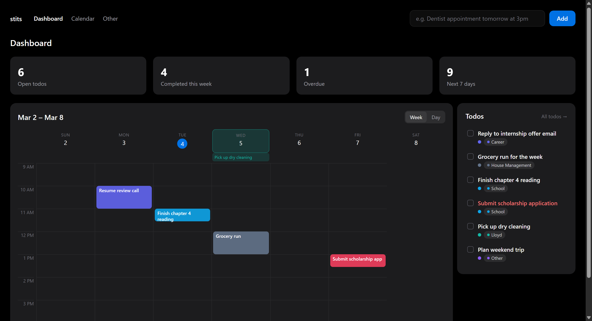

# stits

A single-user productivity dashboard: calendar and todos in one place, built
to be fast to add things to and fast to read at a glance. Built and
maintained by [Russell Allyn](https://www.linkedin.com/in/russell-allyn-b80233268/).


<sub>Sample data — not a real user's todos/schedule.</sub>

## What it does

- **One dashboard.** A week (or single-day) calendar next to an always-visible
  todo list — no separate pages to dig through for "what's on today" vs
  "what's outstanding."
- **Drag a todo onto the calendar to schedule it**, on both mouse and touch.
  Drop it on a day to pin it there with no set time; drop it on a time slot
  and it becomes a 15-minute event at that time, snapped to the quarter-hour.
  This works identically on a phone — it's built on the Pointer Events API
  rather than HTML5 drag-and-drop, which has no touch support at all.
- **Natural-language quick-add.** Type "dentist appointment tomorrow at 3pm"
  into the box at the top and it's parsed into a dated, timed calendar event
  (Claude-powered structured extraction) — no date picker required for the
  common case.
- **Todos with notes, subtasks, priority, and color-coded categories** —
  including due dates, an overdue indicator, and per-category colors you can
  customize.
- **Canvas LMS sync.** Paste a Canvas calendar feed URL and assignment due
  dates / course events pull in automatically, tagged `School`, with
  re-syncs reconciling titles, dates, and removed assignments.
- **A 7am daily digest** pushed to your phone (via Pushover) with the day's
  schedule, due todos, and a quote of the day.
- **Installable PWA** with offline support for a basic "you're offline" page.
- **No account system** — the whole app sits behind one shared password plus
  a push-notification second factor, since it's built for exactly one user.

## Stack

- **Next.js 16** (App Router, React 19) — note this repo tracks a modified
  Next build; see `AGENTS.md`.
- **Postgres** (Supabase), accessed directly with `postgres.js` — the Supabase
  client and its auto-generated REST API are not used.
- **Tailwind CSS v4**.
- **Zod** for API input validation and the quick-add structured output.
- **Anthropic SDK** (`claude-haiku-4-5`) for quick-add parsing.
- **Pushover** for the login second factor.

## Architecture notes

- **Single tenant.** There are no `user_id` columns; the whole app sits behind
  one shared password + a Pushover push code. Auth is a signed
  (`SESSION_SECRET`) HMAC cookie checked in `src/proxy.ts` — this Next build
  calls middleware "proxy", so the file is `src/proxy.ts`, not
  `middleware.ts`.
- **Client data layer.** `src/lib/createEntityStore.ts` backs `useTodos` and
  `useScheduleEvents`: an in-memory cache hydrated once from the API,
  optimistic writes, a full refetch after every mutation, and an error toast
  (with rollback via that refetch) when a write fails.
- **Drag-and-drop** (`src/hooks/useTodoDrag.ts`) is a hand-rolled Pointer
  Events drag engine, not the HTML5 Drag and Drop API — that API has no touch
  equivalent, so it can't support phones at all. Drop targets are plain data
  attributes (`data-drop-zone`, `data-drop-date`, …) on existing calendar
  elements, hit-tested with `elementFromPoint` on pointer-up.
- **API routes** all validate their request body with a schema from
  `src/lib/schemas.ts` before touching the database.
- **Security headers.** `src/proxy.ts` sets a per-request nonce-based CSP;
  `next.config.ts` sets HSTS, `X-Frame-Options`, `Permissions-Policy`, etc.

## Local setup

```bash
npm install
cp .env.example .env.local          # then fill in the values below
# create the schema once against your database:
psql "$DATABASE_URL" -f schema.sql
npm run dev
```

### Environment variables

| Variable             | Required | Notes                                                                                                  |
| -------------------- | -------- | ------------------------------------------------------------------------------------------------------ |
| `DATABASE_URL`       | yes      | Postgres connection string. **Use the Supabase transaction pooler** (`*.pooler.supabase.com`, port `6543`), not the direct `5432` connection — the client is configured for a pooled, `prepare: false` setup. |
| `SESSION_SECRET`     | yes      | Random string; signs the session and pending-2FA cookies.                                             |
| `APP_PASSWORD`       | \*       | Plaintext login password. Optional if `APP_PASSWORD_HASH` is set.                                     |
| `APP_PASSWORD_HASH`  | \*       | Preferred. `scrypt$…` digest from `node scripts/hash-password.mjs '<password>'`. Takes precedence over `APP_PASSWORD`. |
| `ANTHROPIC_API_KEY`  | yes      | For `/api/quick-add`.                                                                                  |
| `PUSHOVER_APP_TOKEN` | yes      | Sends the login code and the daily digest.                                                             |
| `PUSHOVER_USER_KEY`  | yes      | Recipient of the login code and the daily digest.                                                      |
| `CRON_SECRET`        | yes\*\*  | Authorizes `/api/cron/daily-digest`. Vercel Cron automatically sends this as `Authorization: Bearer <value>` once it's set — generate a random string, same as `SESSION_SECRET`. |

\* Set at least one of `APP_PASSWORD` / `APP_PASSWORD_HASH`.
\*\* Only needed if you want the daily digest; without it the cron route just 401s.

## Scripts

| Command             | What it does                                  |
| ------------------- | -------------------------------------------- |
| `npm run dev`       | Dev server.                                  |
| `npm run build`     | Production build.                            |
| `npm run lint`      | ESLint.                                      |
| `npm run typecheck` | `tsc --noEmit`.                              |
| `npm test`          | Vitest (watch).                             |
| `npm run test:run`  | Vitest once (used by CI).                    |

CI (`.github/workflows/ci.yml`) runs lint + typecheck + tests + build on every
push to `main` and every PR.

## Deployment (Vercel)

1. Set every environment variable above in the Vercel project.
2. Point `DATABASE_URL` at the Supabase **transaction pooler**.
3. Generate `APP_PASSWORD_HASH` with `scripts/hash-password.mjs`, set it, and
   remove `APP_PASSWORD`.
4. Run `schema.sql` against the database once (it also enables RLS and revokes
   the default `anon`/`authenticated` grants).
5. `vercel.json` schedules the daily-digest cron twice a day (11:00 and 12:00
   UTC) since Vercel Cron can't shift with DST — the route itself only
   actually sends at 7am US Eastern and no-ops on the other trigger.
